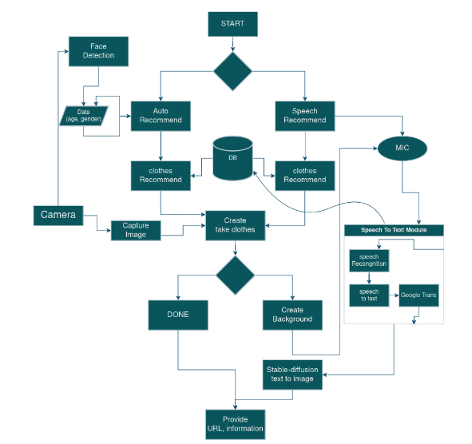
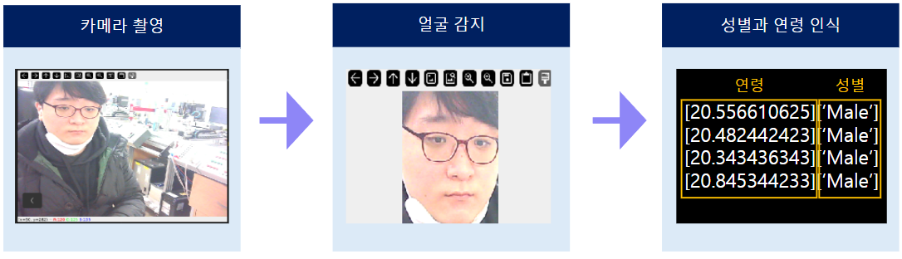
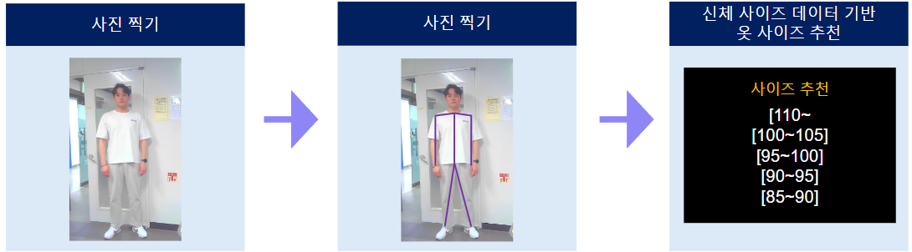
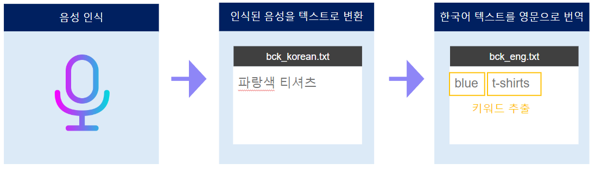
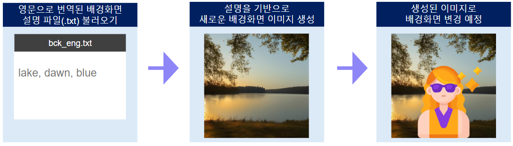
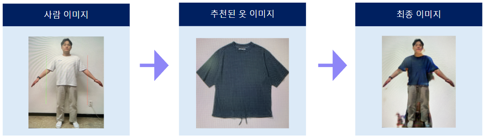

# Da-Ipp

## Contents

1. [High Level Design](#High-Level-Design)
2. [기능](#기능)
3. [run](#Steps-To-Run)
4. [clone code](#Clone-code)

* 다입은 '다 입게해줄게'라는 뜻으로, 의류 매장에 등록되어 있는 옷들을 바탕으로 옷을 데이터베이스에 넣어 직접 선택해 입혀주거나 고객이 선택하기 힘들다면 말(Speech-to-Text)로 추천을 받아 랜덤으로 그와 비슷한 옷을 입혀주고 배경을 바꾸고 싶다면 배경까지 바꿔서 본인의 의상 착용샷을 보여주는 의류 매장 AI 키오스크

## High Level Design

 

---

## 기능

### 얼굴 감지 및 성별, 연령 인식

사용한 모델 : face-detection-retail-0005, age-gender-recognition-retail-0013

신체에서 얼굴 감지 후 Crop을 한 뒤, Crop 된 사진으로 Age 및 Gender 판별



### 신체 사이즈 측정

MediaPipe의 Skeleton Data로 대략적인 신체 사이즈 측정



### 음성 인식

Speech Recognition 라이브러리와 Googletrans를 통해 번역본을 텍스트로 저장 후 키워드 추출



### AI 생성형 이미지

서버를 통해 이미지 생성 후 생성된 이미지 다운로드, 클라이언트에서 Pytorch to openvino를 통해 IR포맷으로 변환 후 txt2img를 서버 없이 단독 실행 가능



### 가상 의류 시착

U2-Net과 ACGPN(CVPR2020)을 통해 사람을 Crop 후 옷을 시착한 상태로 사진을 생성



---
## Clone code

* (각 팀에서 프로젝트를 위해 생성한 repository에 대한 code clone 방법에 대해서 기술)

```shell
git clone https://github.com/bluenight12/da-ipp
```
---
## Prerequite

* (프로잭트를 실행하기 위해 필요한 dependencies 및 configuration들이 있다면, 설치 및 설정 방법에 대해 기술)

```shell
python -m venv .venv
source .venv/bin/activate
pip install -r requirements.txt
```
---
## Steps to run

* (프로젝트 실행방법에 대해서 기술, 특별한 사용방법이 있다면 같이 기술)

```shell
cd ~/xxxx
source .venv/bin/activate

cd /path/to/repo/xxx/
python widgets.py
```
---
## Output

* (프로젝트 실행 화면 캡쳐)


---
## Appendix

* ACGPN : https://github.com/switchablenorms/DeepFashion_Try_On
