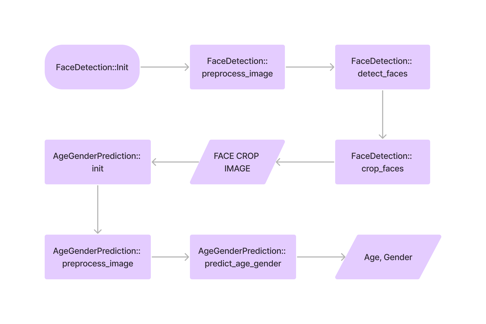
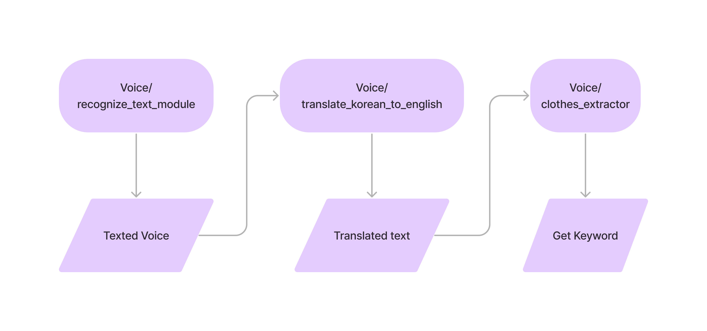
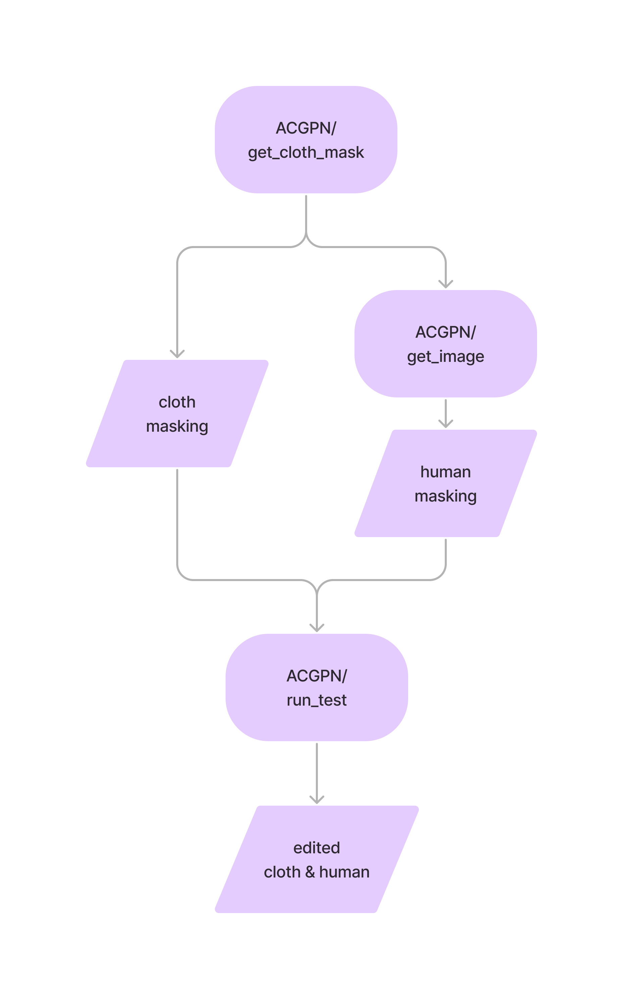
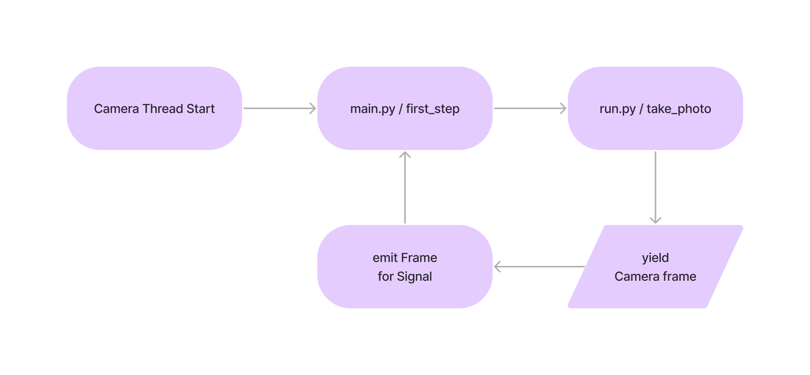
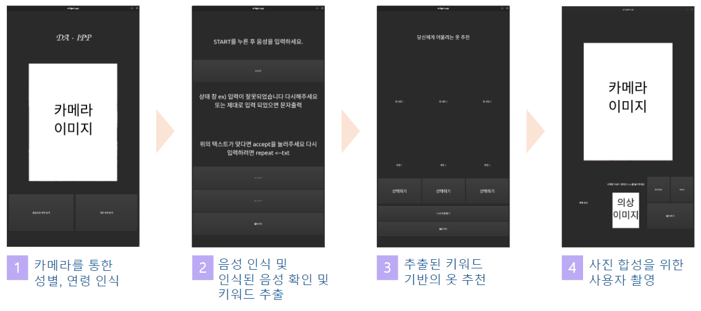
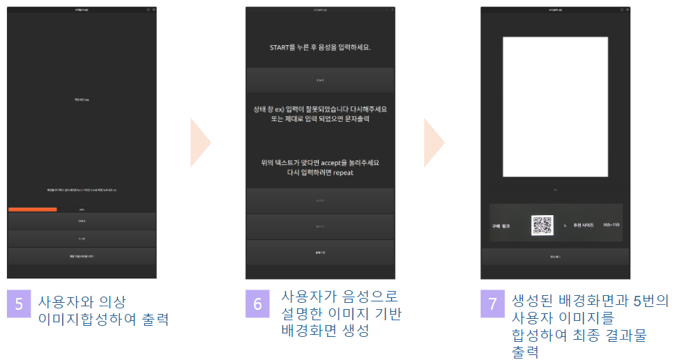

# Da-Ipp

## Contents

1. [High Level Design](#High-Level-Design)
2. [기능](#기능)
    1. [얼굴 감지 및 성별, 연령 인식](#얼굴-감지-및-성별,-연령-인식)
    2. [신체 사이즈 측정](#신체-사이즈-측정)
    3. [음성 인식](#음성-인식)
    4. [AI 생성형 이미지](#AI-생성형-이미지)
    5. [가상 의류 시착](#가상-의류-시착)
    6. [쓰레딩](#쓰레딩)
3. [동작 화면](#output)
4. [Appendix](#Appendix)

* 다입은 '다 입게해줄게'라는 뜻으로, 의류 매장에 등록되어 있는 옷들을 바탕으로 옷을 데이터베이스에 넣어 직접 선택해 입혀주거나 고객이 선택하기 힘들다면 말(Speech-to-Text)로 추천을 받아 랜덤으로 그와 비슷한 옷을 입혀주고 배경을 바꾸고 싶다면 배경까지 바꿔서 본인의 의상 착용샷을 보여주는 의류 매장 AI 키오스크

## High Level Design

 

---

## 기능

### 얼굴 감지 및 성별, 연령 인식

사용한 모델 : face-detection-retail-0005, age-gender-recognition-retail-0013

OpenVino의 모델을 통해 신체에서 얼굴 감지 후 Crop을 한 뒤, Crop 된 사진으로 Age 및 Gender 판별




### 신체 사이즈 측정

MediaPipe의 Skeleton Data로 대략적인 신체 사이즈 측정

```python
results = self.holistic.process(frame_rgb)

left_shoulder = int(                results.pose_landmarks.landmark[self.mp_holistic.PoseLandmark.LEFT_SHOULDER].x * image.shape[1])

right_shoulder = int(    results.pose_landmarks.landmark[self.mp_holistic.PoseLandmark.RIGHT_SHOULDER].x * image.shape[1])
body_size = left_shoulder - right_shoulder

if widget.currentIndex() == 3:
    if body_size < 115:
        seventh.body_size = 85
    elif 115 <= body_size < 125:
        seventh.body_size = 90
    elif 125 <= body_size < 135:
        seventh.body_size = 95
    elif 135 <= body_size < 145:
        seventh.body_size = 100
    elif 145 <= body_size:
        seventh.body_size = 105
```


### 음성 인식

Speech Recognition 라이브러리와 Googletrans를 통해 번역본을 텍스트로 저장 후 키워드 추출




### AI 생성형 이미지

서버를 통해 이미지 생성 후 생성된 이미지 다운로드, 클라이언트에서 Pytorch to openvino를 통해 IR포맷으로 변환 후 txt2img를 서버 없이 단독 실행 가능

```python
model_id = "stabilityai/stable-diffusion-2-1"
pipe = StableDiffusionPipeline.from_pretrained(model_id, torch_dtype=torch.float16)
pipe.scheduler = DPMSolverMultistepScheduler.from_config(pipe.scheduler.config)
pipe = pipe.to("cuda")
image = pipe(prompt).images[0]
```


### 가상 의류 시착

U2-Net과 ACGPN(CVPR2020)을 통해 사람을 Crop 후 옷을 시착한 상태로 사진을 생성




### 쓰레딩

UI와 상호작용 간 원활한 촬영 및 송출을 위해 Input Camera를 QThread로 처리하고 각 Widget에 Emit event 송신


---
## Clone code

* (각 팀에서 프로젝트를 위해 생성한 repository에 대한 code clone 방법에 대해서 기술)

```shell
git clone https://github.com/bluenight12/da-ipp
```
---
## Prerequite

```shell
python -m venv .venv
source .venv/bin/activate
pip install -r requirements.txt
```
---
## Steps to run

```shell
cd ~/xxxx
source .venv/bin/activate

cd /path/to/repo/xxx/
python widgets.py
```
---
## Output



---
## Appendix

* ACGPN : https://github.com/switchablenorms/DeepFashion_Try_On
* Face Detection : https://github.com/openvinotoolkit/open_model_zoo/blob/master/models/intel/face-detection-retail-0005
* Age, Gender Prediction : https://github.com/openvinotoolkit/open_model_zoo/tree/master/models/intel/age-gender-recognition-retail-0013
* MediaPipe : https://developers.google.com/mediapipe/solutions/vision/gesture_recognizer/python
* SpeechToText : https://cloud.google.com/speech-to-text
* googletrans : https://py-googletrans.readthedocs.io/en/latest/
* stable-diffusion : https://huggingface.co/stabilityai/stable-diffusion-2-1
* stable-diffusion-openvino : https://github.com/openvinotoolkit/openvino_notebooks/tree/master/notebooks/stable-diffusion-text-to-image
* opencv : https://opencv.org/